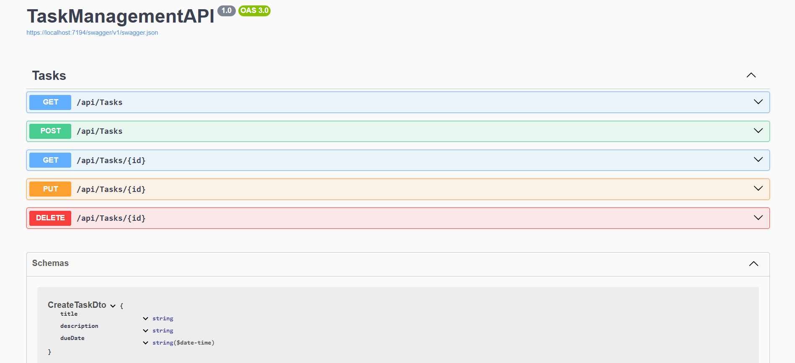

# Task Management API

A simple REST API for managing tasks. **Junior backend project** — portfolio-ready.

## Tech Stack

**Backend:** C#, .NET 8, ASP.NET Core Web API  
**Database:** SQLite, Entity Framework Core 8  
**Tools:** Swagger, Git

## Features / Endpoints

| Method | Endpoint | Description |
|--------|----------|-------------|
| GET | `/api/tasks` | Get all tasks |
| GET | `/api/tasks/{id}` | Get task by ID |
| POST | `/api/tasks` | Create a task |
| PUT | `/api/tasks/{id}` | Update a task |
| DELETE | `/api/tasks/{id}` | Delete a task |

## How to Run

1. Clone the repo.
2. Open the solution in Visual Studio.
3. Restore NuGet packages (right-click solution → Restore NuGet Packages, or `dotnet restore`).
4. Run the project (F5 or **Debug → Start Debugging**).
5. Swagger UI opens automatically, or go to:
   - **HTTP:** `http://localhost:5111/swagger`
   - **HTTPS:** `https://localhost:7194/swagger`

## API Preview

## Contact

- **GitHub:** https://github.com/Nonaamme
- **Email:** bedin0102@gmail.com
